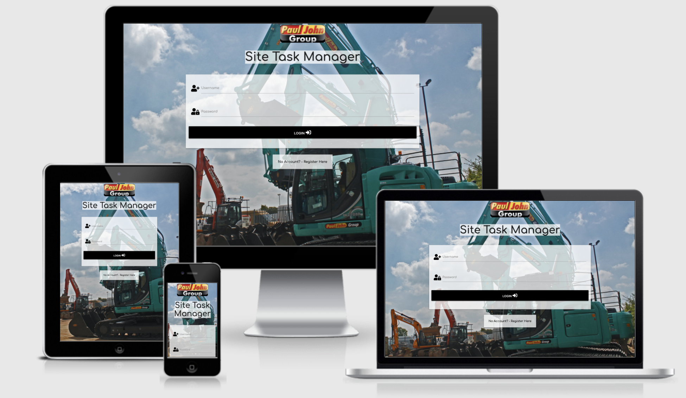

Site Task Manager - Website - MS3
---
## Table of Contents

- [**About**](#About)
- [**UX**](#UX)
  - [Goals](#Goals)
  - [User Stories](#User-Stories)
  - [Styling](#Styling)
  - [Wireframes](#Wireframes)
- [**Features**](#Features)
  - [Existing Features](#Existing-Features)
  - [Features Left To Implement](#Features-Left-To-Implement)
- [**Technologies Used**](#Technologies-Used)
  - [Version Control](#Version-Control)
- [**Testing**](#Testing)
  - [Testing User Stories](#Testing-User-Stories)
  - [Responsive Testing](#Responsive-Testing)
  - [Additional Testing](#Additional-Testing)
  - [Code Validation](#Code-Validation)
- [**Deployment**](#Deployment)
  - [Live Website Link](#Live-App-Link)
  - [Repository Link](#Repository-Link)
  - [Running Code Locally](#Running-Code-Locally)
- [**Credits**](#Credits)
  - [Content](#Content)
  - [Media](#Media)
  - [Acknowledgements](#Acknowledgements)
  
---

## About

The website was created for Paul John Group to help the control of tasks between senior management and site staff on construction sites.

The mission was reduce the use of paperwork and email have a system that can be used to assign and track tasks that have been assigned to staff on site.

The website needed to be have limited options for site staff when they logged in so tasks cant be changed and be deleted by them. Contract Managers and senior management would have full access right to change database fields and tasks.

Users are assigned as Admin or not via the webmaster.

___

## UX

#### Goals

The goals of the website were:-
- To hold information on various tasks for site staff to complete and be able to track back on tasks that had been completed.
- The website must tie in with the company profile with the logo and images.
- The website must have a secure login for each employee
- The website must show correct on all devices from Laptops to mobile phones and tablets.

---

#### User Stories

From the Designers Perspective:-
- The site needs to be easy to use and navigate due to the nature of business it will be used in.
- The site needs to be easy to view on all devices.
- The background and logo need to be construction and Paul John Group related.
- The system must have a clear difference between what a standard user can access and what a admin user can access.
- Other Database fields and tables must be easy to access to CRUD via the website for the admin user.
- The website and database access needs to be quick.
- There must be a clear difference to view open tasks and completed tasks.

From the users perspective:-
- I need to be easily access a task and complete it.
- I need to be find it easy to add tasks to database for different users and sites.
- I need to be able to add different tasktypes and assign them to tasks.
- I need to be able to search completed tasks based on words in the description.
- I need to be able to register standard users to the system.
- I need to site to have admin access and standard user access.
- I need standard user access locked down so data is only relevant to that user.
- I need admin access to give full access to the website.
- As admin I need to be able to search completed tasks.

---

### Styling

The website must be easy on the eye but also you must be able to see the different fields, forms and buttons. I used a clear white see through background for forms and cards, used black, red or green for the buttons so they stood out and used black text Colour. The background image was an image that was construction related with a good colour scheme.

The below colour scheme was used for the menus and text.

The font chosed was Comfortaa because it was clear and concise. The backup font if google fonts didnt load is Sans-Serif.

The background image used for the site was a background of the sky and machines to keep with the construction theme.

---

### Wireframes

Wireframes Link - [Wireframes](Documentation/Wireframes/WireframesandDBDesign.pdf)

**Design Changes to Wireframes**
- New Background image used which was clearer on all size screens.
- Changed the layout of the tasks information to go vertically instead of horizontal.
- Removed Social Media links from footer - not required just to software being used internally only.
- isAdmin field added to the user table is database design. This was a Boolean field. This can only be assigned to true by logging into mongodb as the system admin.

---

## Features

### Existing Features

- The navigation menu shows at the top but shrinks to a burger on smaller devices and shows on the right side of the screen.
- Users can login and register to the system which will give them standard user access.
- Admin access must be given by the system administrator with access to MongoDB
- Different menu options show between admin and standard user. 
- Admin users have access to all tasks for all users, all completed tasks for all users and management of tasktypes and sites.
- Standard users have access to there own tasks that have been assigned by a manager and there own completed tasks.
- Tasks are written in collapsible headers that can be expanded to view more information on the task.
- When a user logs in, the username and isAdmin is stored in a session variable in a cookie until the user logs out.
- The footer is pinned to the bottom of all pages.
- CRUD can be done by admin users on tasks, tasktypes and sites.
- Edit and Delete buttons are hidden for standard users, only admin have access to these buttons on manage tasks.
- Complete button is the only button shown to standard users.
- Sites and Tasktypes and Users are linked via the database when adding a new task.
- All fields must be completed when adding a task apart from the completion fields.
- Fields are checked when adding a task and marked red if not filled out.
- The due date field is DD/MM/YYYY - A data selector is always used to pick the date to avoid any data mismatches.
- A search function is only available for admin users on completed tasks so they can search on Product Descriptions and tasktypes for keywords.

### Features Left To Implement

- Pagination needs to be added as the database grows on complete tasks.
- Admin users can authorise other users in the database to be admin via user management
- Reports Menu to be added to Admin users so they can run reports on users and in date ranges.

---

## Technologies Used

- Materialize
  - Materialize was used for page structures and features like collapisble tasks and cards.

- HTML  
  - HTML was used for the main structure of the website.

- JQuery
  - JQuery was used for materialize features that needed some javascript function - Side Menu, Collapsible.

- CSS
  - CSS was used to style and change sizes and positions of different items where materialize couldn't be used.

- Python 
  - Flask
    - Flask was used for rendering template, URI's, Redirects, Requests and flash messages.
  - Bson
    - BSON was used to access the data in MongoDB and to access ID's
  - Werkzeug
    - Werkzeug was user to hash password entry when registering to the site and encrypting on MongoDB.

- MongoDB
  - MongoDB was used to store all data for the website.

- Google Chrome
  - Google Chrome Inspect and Developer tools was used for examining the website on different devices.

- Google Fonts
  - Google fonts was used for the font of the website.

- Font Awesome
  - Font Awesome was used for the icons on the forms.

- VS Code 
  - VS Code was used as the development tool to create all pages. Different add-ons were used in VS Code to aid my developement. These add-ons included were:-
    - Auto Close and Rename Tag - to end tags automatically.
    - Beauty - To help Beautify my coding.
    - Color Highlight - Shows the colours in your coding.
    - CSS Peek - Allows you to show the CSS Next to your HTML Code, rather than going between the two files.
    - Live Server - Allows you to see the live webpage as you code
    - Markdown Preview Enhancer - Allows you to see your markdown file as you type.
    - Prettier - Allows you to Beautify your CSS.

- Balsamiq was used to create the wireframes

### Version Control

- VS Code
  - VS Code linked to the repositry in Github was used to do regular Commits from my changes and additions to the website.

- Github
  - Github was used to store the repositry online. All Adds/Commits go to this file online. 

- Heroku
  - Heroku was used to store and run the application, heroku was linked to github to auto update.

---

## Testing

### Testing User Stories

| Story  |  Test | Extra Coding Required  |
|---|---|---|
|The site needs to be easy to use and navigate due to the nature of business it will be used in| Tested all menus on all devices to make sure they were easy to understand and follow|N/A |
|The site needs to be easy to view on all devices| Tested the site on all devices to make sure it displayed correctly|Changed some size displays of card to show on multiple lines on smaller devices |
|The background and logo need to be construction and Paul John Group related| Tested the background and logo on all devices|Background size changed to show better on Ipad and IPhone |
|The system must have a clear difference between what a standard user can access and what a admin user can access|Logged in as different users to make sure different menus are displayed | Created isAdmin on MongoDB and used this in a session variable and jinja to distinguish between isAdmin being true or false|
|Other Database fields and tables must be easy to access to CRUD via the website for the admin user| Accessed Tasktypes and sites to managed these fields on all devices| N/A|
|The website and database access needs to be quick| Tested logging in on different devices|N/A |
|There must be a clear difference to view open tasks and completed tasks| Tested Manage Tasks and Completed Tasks|Extra Jinja and Python added to distinguish IsComplete = True or false, two variables created for user and admin for tasks and completed tasks |
|I need to be easily access a task and complete it| tested as a user and admin by access a task and completing it| N/A|
|I need to be find it easy to add tasks to database for different users and sites|Tested the add task page on different devices | Jquery coding added to show required fields in red if not filled in|
|I need to be able to add different tasktypes and assign them to tasks| added tasktypes from the menu and then added a new task and tested the dropdown menu tomake sure the new tasktype showed| N/A|
|I need to be able to search completed tasks based on words in the description|Tested various searchs with different words |added jinja code sothe search function showed for only admin users only |
|I need to be able to register standard users to the system| register different users from the company and made CM's Admins in Mongo DB and left the others as standard users| N/A|
|I need to site to have admin access and standard user access| Initially had it querying against user 'Admin' but only this one user had admin rights|Added isAdmin - Boolean field so more users could be admin users then changed my python and jinja coding on tasks and completed tasks and the menu on base.html |
|I need standard user access locked down so data is only relevant to that user| initially checked against user 'admin' on the session cookie| coded to checked against isAdmin =False and the username logged in against the session variable and user on mongoDB|
|I need admin access to give full access to the website| Checked against isAdmin to show more menu options on the navigation and show all tasks for all users on manage tasks and completed tasks|N/A |
|As admin I need to be able to search completed tasks| Tested with various searches on the test data on various devices| error in the card showing the search going onto multiple lines, corrected the code.|

### Responsive Testing

To check how the site ran on different devices I used Am-I-Responsive and Inspect in Google Chrome Developer Tools. I also pushed out the site regular to the live area and accessed the link on my IPhone, Ipad and Macbook. While doing these tests I did the following:-

|  Test | Result  |  Extra Coding Required |
|---|---|---|
| Navigation Menu shows burger on small devices| Navigation menu working correctly| N/A|
| Task information shows on each line in the card on all devices| Tested on all devices| N/A|
| Background Image to show correctly on all devices|Background didn't show correctly on Ipad on Am-I-Responsive |changed background options in CSS |
| Manage Tasktypes and Sites boxed should shrink correct to show on mobiles and tablets|All boxes showed correctly | N/A|
| Buttons should show on the right side when viewing tasks|all buttons showing correctly |N/A |
| Footer showing correctly on all devices| Footer didn't show correctlyon some pages| Added a top margin to the footer|

### Additional Testing

I also carried the following addtional testing:-
|  Test | Result  |  Extra Coding Required |
|---|---|---|
|Adding users,tasktypes and tasks | All showed correctly on the site and in mongoDB| N/A |
|Changed tasks as a admin user via the edit button| all changes showed correctly on the site and mongodb| N/A|
|Deleted tasks as a admin user| deleted tasks no longer showing on site and MongoDB| N/A |
|Tested diferent user logins and registrations and checked the session cookies in google chrome| logins working correct and cookies and users added to MongoDB | N/A|
|Slack users testing| Button changed from Edit to confirm|Button Text changed |
|Slack users - Href for company logo not linked| Didn't link to any page|Linked logo to manage tasks page |
|Logo not showing alt if not displaying | nothing showed|alt added in html |
| Tested Login of a user who already existed|User didn't added to the database and flash message showed user already exists | N/A |

### Code Validation

W3C Markup Validation Service and W3C CSS Validation Service was used for validating the code.

 ---

## Deployment

### Live Website Link

https://site-task-manager-ms3.herokuapp.com/
 
The website link was created by doing the following steps.

1. Type

### Repository Link

https://github.com/MattMoore050783/SiteTaskManager-MS3

### Running Code Locally

Type

---

## Credits

### Code

I used the following links to help my coding:-
- Code Institue task project for basic setup and and linking to MongoDB
- https://www.tutorialspoint.com/materialize/index.htm - For Materialize tips
- https://werkzeug.palletsprojects.com/en/1.0.x/utils/ - for Werkzeug tips
- https://palletsprojects.com/p/jinja/ - for Jinja coding
- https://stackoverflow.com/ - for various issues when writing queries in Python.
- https://www.w3schools.com/python/default.asp - for extra help and tuition with Python.
- https://www.youtube.com/watch?v=dam0GPOAvVI - for extra help with python and flask to understand it better.

### Content

All content for the site was based on what would be required by Paul John employees if this app was to be live.

### Media

All pictures were taken from Paul John on our existing website which I also developed

### Acknowledgements

Many Thanks to the below for the help and guidances throughout my project:- 
- My Mentor Maranatha
- Code Institues support team for increasing my hand in date and being supportive while i was working my day to day job through the pandemic.
- The slack community for feedback on my website. 
- Code Institute and the learning programme Python and the task mini project.

